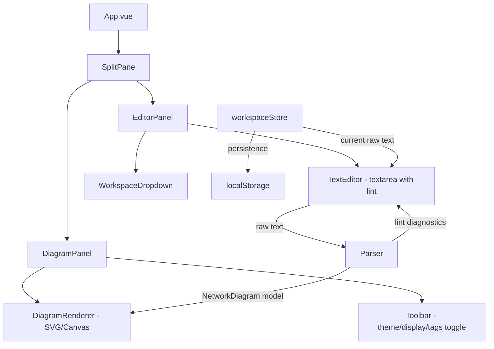

# German-Shepherd — 資訊系統網路架構管理頁面

開發一個純前端 SPA，讓使用者以類似 Mermaid 的自定義 DSL 語法編寫「資訊系統網路架構圖」，並即時在檢視區塊中以視覺化方式呈現。

## 從 border-collie 沿用的設計模式

| 項目 | 沿用方式 |
|------|----------|
| 專案框架 | Vue 3 + Vite + TypeScript + Pinia |
| CSS 設計系統 | 直接引用 `border-collie/src/shared/styles/variables.css`（dark/light 主題、glassmorphism、typography） |
| SplitPane | 複製並調整 `SplitPane.vue` 元件（左編輯/右檢視，可拖曳調整寬度，可 toggle 滿版） |
| Workspace 管理 | 參考 `workspaceStore.ts` 模式（Pinia + localStorage，多工作區切換、新增、刪除） |
| Frontmatter Parser | 參考 `frontmatterParser.ts` 模式解析 `title/display/theme` 的 header 區段（用 `---` 分隔） |
| Editor 面板 | 參考 `EditorPanel.vue` / `TextEditor.vue` 的面板佈局與 toolbar 設計 |

---

## 整體架構



---

## Proposed Changes

### Phase 1: 專案初始化

#### [NEW] package.json / vite.config.ts / tsconfig.json
- 使用 `npx -y create-vite@latest ./ --template vue-ts` 初始化
- 安裝 dependencies: `vue`, `pinia`, `@vueuse/core`
- 安裝 devDependencies: `vitest`, `@vue/test-utils`, `happy-dom`
- 設定 `@` alias 指向 `src/`
- base path 設定 GitHub Pages 相容

#### [NEW] src/assets/main.css
- 引入 border-collie 的 `variables.css` 作為設計系統基礎
- 加入 German-Shepherd 特有的 CSS utility（diagram 相關顏色變數、zone 色彩等）

#### [NEW] index.html
- 載入 Google Fonts: Inter + JetBrains Mono
- 載入 Font Awesome 6 CDN（供 icon theme 使用）
- Meta tags: title, description

---

### Phase 2: 資料模型與型別定義

#### [NEW] src/types/index.ts

定義核心資料結構：

```typescript
// ===== Metadata =====
interface DiagramMeta {
  title: string
  display: 'TD' | 'LR'     // 預設 LR
  theme: 'simple' | 'icon' | 'image'  // 預設 simple
}

// ===== 節點 =====
type NodeType = 
  | 'App' | 'Web'                            // 客戶端
  | 'Firewall' | 'WAF' | 'F5' | 'Storage'   // 網路設備
  | 'AP Server' | 'Web Server' | 'SAP' | 'Database'  // 服務器

interface DiagramNode {
  id: string           // 自動生成（基於名稱）
  name: string         // 節點名稱（唯一識別）
  type: NodeType
  note?: string        // 特殊註記
  tags?: string[]      // 標籤 (如 ['核心系統', '將汰換'])
  zonePath: string[]   // 所屬區段路徑 (如 ['DMZ2', 'MASA'])
}

// ===== 區段 =====
interface DiagramZone {
  name: string
  children: (DiagramZone | DiagramNode)[]  // 最多三層巢狀
  depth: number        // 0=root, 1=sub, 2=sub-sub
}

// ===== 連線 =====
type ConnectionDirection = 'forward' | 'bidirectional' | 'none'
// forward: A -> B
// bidirectional: A <-> B
// none: A -- B

type ConnectionType = 
  | 'HTTP' | 'SOAP' | 'WebSocket' | 'gRPC' 
  | 'RFC' | 'FTP' | 'Socket' | 'Others'

interface DiagramConnection {
  from: string          // 節點名稱
  to: string            // 節點名稱
  direction: ConnectionDirection
  protocol: ConnectionType
  description?: string  // 連線說明
}

// ===== 完整架構圖 =====
interface NetworkDiagram {
  meta: DiagramMeta
  zones: DiagramZone[]
  connections: DiagramConnection[]
  nodes: DiagramNode[]  // flat list (方便查詢)
}

// ===== Lint =====
interface LintDiagnostic {
  line: number
  column: number
  message: string
  severity: 'error' | 'warning' | 'info'
}
```

---

### Phase 3: Parser

#### [NEW] src/parser/metaParser.ts
- 解析 `---` 前的 header 區段
- 提取 `title`, `display`, `theme`
- 缺省值: `display = 'LR'`, `theme = 'simple'`

#### [NEW] src/parser/diagramParser.ts
核心 parser，解析 `---` 後的 body 區段：

**區段 & 節點解析規則：**
- 以縮排層級（2 spaces 為一級）判斷結構：
  - 無縮排 + 結尾 `:` → 頂層區段
  - 有縮排 + 結尾 `:` → 子區塊（最多 3 層）
  - `- name, type` 開頭 → 節點
- 節點格式: `- 名稱, 類型, 特殊註記, #tag1 #tag2`
  - 名稱、類型必填；註記、標籤可選
  - 標籤以 `#` 前綴辨識，可多個空格分隔

**連線解析規則：**
- `A -> B: protocol, description` → 單向
- `A <-> B: protocol, description` → 雙向
- `A -- B: protocol, description` → 無方向
- description 可選
- 連線使用**完整節點名稱**匹配

#### [NEW] src/parser/linter.ts
- **孤立節點檢查**：若節點未出現在任何連線中 → warning
- **未定義節點引用**：連線中引用了不存在的節點名稱 → error
- **無效類型檢查**：節點類型不在支援列表中 → error
- **無效通訊方式**：連線 protocol 不在支援列表中 → error
- **重複節點名稱**：同名節點重複定義 → error
- 回傳 `LintDiagnostic[]`，含行號與提示訊息

#### [NEW] src/parser/index.ts
- 統一匯出 `parseNetworkDiagram(rawText: string): { diagram: NetworkDiagram, diagnostics: LintDiagnostic[] }`

#### [NEW] src/parser/__tests__/diagramParser.test.ts
- 基本區段解析
- 巢狀子區塊（1~3 層）
- 節點格式解析（含/不含標籤、註記）
- 三種連線方向
- Lint 測試案例

---

### Phase 4: 狀態管理 (Pinia Stores)

#### [NEW] src/stores/workspaceStore.ts
沿用 border-collie 的 workspace 管理模式：
- 多工作區管理（localStorage key: `german-shepherd-workspaces`）
- `init()` → 載入/建立預設工作區（內建範例資料）
- `switchWorkspace()` / `createWorkspace()` / `deleteWorkspace()`
- `updateCurrentRawText()` → 更新文字並觸發重新 parse
- throttled `persist()` → localStorage

#### [NEW] src/stores/diagramStore.ts
- `rawText` → 來自 workspaceStore 的當前工作區文字
- `parsedDiagram` (computed) → 透過 parser 即時解析
- `diagnostics` (computed) → lint 結果
- `lintEnabled` (ref) → lint 開關
- `showTags` (ref) → 檢視區標籤顯示開關

---

### Phase 5: UI 元件

#### [NEW] src/components/SplitPane.vue
- 複製 border-collie 的 `SplitPane.vue`
- 保留拖曳調整寬度、toggle 收合/滿版功能
- `initialRatio="0.35"`, `minLeft=320`, `minRight=400`

#### [NEW] src/components/EditorPanel.vue
- 頂部 toolbar: `WorkspaceDropdown` + Lint 開關
- 內容: `TextEditor`（textarea）
- 編輯區支援：
  - 等寬字型 (JetBrains Mono)
  - 行號顯示
  - Lint highlight：在 textarea 旁側/overlay 標示有問題的行（紅色底線/背景色）

#### [NEW] src/components/TextEditor.vue
- 使用 `<textarea>` 搭配行號 overlay
- Lint diagnostics 以行為單位標示（行號列變色 + tooltip 顯示訊息）
- `v-model` 綁定 rawText

#### [NEW] src/components/WorkspaceDropdown.vue
- 沿用 border-collie 的設計（dropdown 選單、新增/刪除/切換工作區）

#### [NEW] src/components/DiagramPanel.vue
- 頂部 toolbar: title 顯示、theme 切換、display 切換 (TD/LR)、tags toggle、dark/light 主題切換
- 內容: `DiagramRenderer`

#### [NEW] src/components/DiagramRenderer.vue
核心視覺化元件，使用 **SVG** 渲染：

**佈局演算法：**
- 根據 `display` 設定選擇 TD 或 LR 方向
- 區段 (Zone) → 帶標題的圓角矩形容器
- 子區塊 → 嵌套容器（略深背景色）
- 節點 → 根據 theme 渲染不同外觀
- 連線 → SVG path，帶箭頭/雙箭頭/無箭頭
- 自動排版：簡單的 grid-based layout
  - TD: 各 zone 從上到下排列，每個 zone 內節點水平排列
  - LR: 各 zone 從左到右排列，每個 zone 內節點垂直排列

**Theme 渲染：**
- `simple`: 方框 + 類型文字 + 名稱
- `icon`: Font Awesome icon + 名稱（依 NodeType 對應 icon）
- `image`: 自訂 SVG 圖示 + 名稱（之後擴展，先用簡化版佔位）

**節點外觀：**
- 名稱（主要文字）
- 類型（小字/icon）
- 特殊註記（小字標註，灰色）
- 標籤（badge，可 toggle 顯示/隱藏）
- Lint 異常節點 → 紅色邊框 + warning icon

**連線呈現：**
- 正交/曲線連線（SVG path with bezier curves）
- 箭頭方向依 `direction` 決定
- 連線上標註 protocol + description

**預留 diff：**
- 節點/連線元件接受 `diffState?: 'added' | 'removed' | 'modified'` prop
- 對應不同 highlight 顏色（green/red/yellow）

#### [NEW] src/components/NodeRenderer.vue
- 單一節點的 SVG 渲染元件
- props: `node`, `theme`, `showTags`, `diffState?`
- 根據 theme 切換渲染方式

#### [NEW] src/components/ConnectionRenderer.vue
- 單一連線的 SVG 渲染元件
- props: `connection`, `fromPos`, `toPos`, `direction`
- 渲染路徑 + 箭頭 + 標籤

---

### Phase 6: 主要入口

#### [NEW] src/App.vue
參考 border-collie 的架構：
```vue
<SplitPane :initial-ratio="0.35" :min-left="320" :min-right="400">
  <template #left>
    <EditorPanel />
  </template>
  <template #right>
    <DiagramPanel />
  </template>
</SplitPane>
```
- Dark mode（預設）/ Light mode 切換
- onMounted: 初始化 workspaceStore

---

### Phase 7: 測試 & 驗證

#### [NEW] src/parser/__tests__/diagramParser.test.ts
- 完整的 parser 單元測試

#### [NEW] src/parser/__tests__/linter.test.ts  
- 完整的 linter 單元測試

---

## Font Awesome Icon 對照表

| NodeType | Icon Class | 說明 |
|----------|-----------|------|
| App | `fa-mobile-screen` | 手機 App |
| Web | `fa-globe` | 瀏覽器 |
| Firewall | `fa-shield-halved` | 防火牆 |
| WAF | `fa-shield` | WAF |
| F5 | `fa-arrows-split-up-and-left` | 負載均衡 |
| Storage | `fa-hard-drive` | 儲存 |
| AP Server | `fa-server` | 應用伺服器 |
| Web Server | `fa-server` + badge | Web 伺服器 |
| SAP | `fa-building` | SAP 系統 |
| Database | `fa-database` | 資料庫 |

---

## 連線語法彙整

| 語法 | 方向 | 範例 |
|------|------|------|
| `A -> B: protocol` | 單向 (A→B) | `AP 2.0 -> AP IDP: HTTP, 登入` |
| `A <-> B: protocol` | 雙向 | `Auth <-> AP IDP: HTTP, 驗證` |
| `A -- B: protocol` | 無方向 | `NAS -- Backup: Others, 同步` |

---

## User Review Required

> [!IMPORTANT]
> **CSS 引用策略**：計畫直接透過 Vite alias 引入 border-collie 的 `shared/styles/variables.css`。如果 border-collie 和 german-shepherd 要獨立部署，需改為**複製**該檔案到 german-shepherd 專案內。請確認偏好的方式。

> [!IMPORTANT]  
> **SVG vs Canvas**：視覺化渲染計畫使用 SVG（較易實現互動、tooltip、CSS 動畫）。如果架構圖節點數量可能超過 200+，Canvas 會更有效能優勢。請確認預期的節點規模。

> [!IMPORTANT]
> **自動排版演算法**：初版使用簡單的 grid-based layout（按 zone 依序排列，zone 內節點 grid 排列）。如果需要更智慧的排版（如根據連線關係自動分群），會顯著增加複雜度。建議先以 grid layout 為 MVP，後續迭代改進。

---

## Verification Plan

### Automated Tests
- `npm run test` → Vitest 執行 parser + linter 單元測試
- Browser test: 啟動 dev server → 使用 browser tool 驗證：
  1. 頁面載入，SplitPane 正常顯示
  2. 在編輯區貼上範例文字 → 檢視區即時顯示架構圖
  3. 切換 theme (simple → icon) → 圖示正確切換
  4. 切換 display (LR → TD) → 排版方向正確改變
  5. Lint 開關 → 標記/取消標記孤立節點
  6. Tags toggle → 標籤顯示/隱藏
  7. SplitPane 拖曳、toggle 滿版
  8. 新增/切換/刪除工作區
  9. 重新整理頁面後資料仍在（localStorage）

### Manual Verification
- 使用者驗收 UI 設計風格是否符合預期
